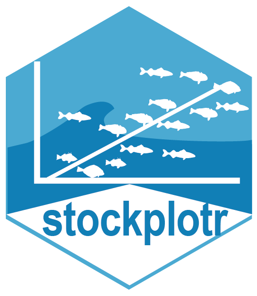
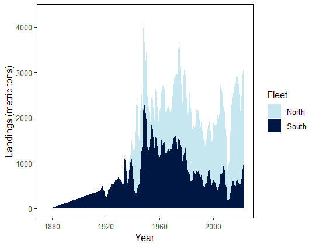
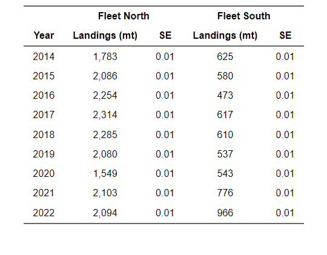

# stockplotr

<!-- badges: start -->
[](https://lifecycle.r-lib.org/articles/stages.html#experimental)
[](https://github.com/nmfs-ost/stockplotr/tree/badges)
[](https://github.com/nmfs-ost/stockplotr/actions/workflows/call-r-cmd-check.yml)
<!-- badges: end -->



***Previously named 'satf'***

The goal of `stockplotr` is to create a centralized package that contains all of
the figures and tables for a stock assessment report used to inform management. 
There are multiple current packages that perform a 
similar function, but they are typically region and/or model dependent. Across 
the US, there are multiple packages that create plots that are directly used in 
a stock assessment report used for management. For example, an analyst that uses 
Stock Synthesis (SS3) to assess a stock will utilize [`r4ss`](https://github.com/r4ss/r4ss/), 
a package that reads outputs, plots key parameters, and more to increase 
throughput and reduce tedious tasks for an analyst.

Please note that this package is still in development. As such, some functions 
are unstable and might not perform as intended. We encourage anyone who tests 
out this package to leave an [issue](https://github.com/nmfs-ost/stockplotr/issues)
for any errors you find or for a feature request.

## Installation

Install the package using one of the three following ways:

(1) Using `pak`

```r
install.packages("pak")
pak::pak("nmfs-ost/stockplotr")
```

(2) Using `remotes`

```r
install.packages("remotes")
remotes::install_github("nmfs-ost/stockplotr")
```

(3) From the nmfs-ost r-universe

```r
install.packages("stockplotr", repos = c("https://nmfs-ost.r-universe.dev", "https://cloud.r-project.org"))
```

## Usage

Please refer to the [`asar` tutorial](https://connect.fisheries.noaa.gov/asar_tutorial/#section-preparing-to-run-create_template) to learn how to produce the input file necessary to create figures and tables with `stockplotr`.

Then, once your converted model results are saved as an object in your R environment, you can use `stockplotr` functions to create plots from the object.

> [!TIP]
> `stockplotr` plots or tables are exported as `ggplot2` or `flextable` objects 
> meaning that users can use the same process to add new data, formatting, or 
> other customizations to the plot beyond the baseline made by this package

### Example

```r
data <- stockplotr:::example_data

# create a landings figure from your object
plot_spawning_biomass(data)
```

Example Plot | Example Table |
:------------|---------------:
 | 

> [!NOTE]
> Tables are not currently included in the package due to a major overhaul.
> We plan to incorporate them by the end of 2025.

## Contributions

Have you identified any suggestions for improvement, bugs, or questions? Please see our [Contributing page](https://github.com/nmfs-ost/stockplotr/blob/main/CONTRIBUTING.md) for more information on how to make effective contributions to `stockplotr`.

Thank you for helping us improve this package!

## Code of Conduct

We as members, contributors, and leaders pledge to make participation in our community a harassment-free experience for everyone, regardless of age, body size, visible or invisible disability, ethnicity, sex characteristics, gender identity and expression, level of experience, education, socio-economic status, nationality, personal appearance, race, caste, color, religion, or sexual identity and orientation. We pledge to act and interact in ways that contribute to an open, welcoming, diverse, inclusive, and healthy community.

All contributors participating and contributing to the asar project are expected to adhere to the [Code of Conduct](https://github.com/nmfs-ost/stockplotr/blob/main/CODE_OF_CONDUCT.md).

## User Community

We hope that this package will be able to be a one stop shop for plots regarding 
interpreting assessment models and presenting the results to managers and relevant 
stakeholders. We encourage interested users to contribute to this package using 
their custom code when they find it may be useful across the nation.

> [!NOTE]
> An additional package to plot model diagnostics called [FIMSdiags](https://github.com/NOAA-FIMS/FIMSdiags) 
> is being worked on for the Fisheries Integrated Modelling System [FIMS] that 
> will natively work with the output used for stockplotr since the model output 
> for FIMS works together with stockplotr.

## Disclaimer

This repository is a scientific product and is not official communication of the National Oceanic and Atmospheric Administration, or the United States Department of Commerce. All NOAA GitHub project code is provided on an ‘as is’ basis and the user assumes responsibility for its use. Any claims against the Department of Commerce or Department of Commerce bureaus stemming from the use of this GitHub project will be governed by all applicable Federal law. Any reference to specific commercial products, processes, or services by service mark, trademark, manufacturer, or otherwise, does not constitute or imply their endorsement, recommendation or favoring by the Department of Commerce. The Department of Commerce seal and logo, or the seal and logo of a DOC bureau, shall not be used in any manner to imply endorsement of any commercial product or activity by DOC or the United States Government.
